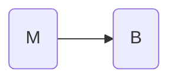
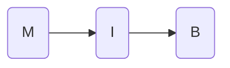

Database Design & -Programming
============================

> **Disclaimer**
> These are notes created for my personal use. They mostly cover the contents of the lectures. I take no responsibility for the correctness of anything stated in the contents, although I strive for making them as accurate as possible. If you find any factual or formal mistakes in these notes, please don't hesitate to contact me at [kiraly.bence.1025@gmail.com](mailto:kiraly.bence.1025@gmail.com).

## Introduction

Recommended book: Information Modeling and Relational Databases by Terry Halpin
Relational databases - Based on Set theory
Hierarchical databases
Blockchain
NoSQL

A database is the backend of every computing system.
Persistent data storage for large amounts of data with simple access points
Data is much harder to recreate than hardware or software
Database applications are the 'active' part of DB systems

History of database systems:

* File system
	* Limited linkage and integrity management
	* Limited access control
* Excel files
	* Better linkage and integrity
	* Problems with data inconsistency
	* Security concerns
	* No centralized mechanism to replicate data across multiple systems
* Relational Databases
	* Database language
		* Structured Query Language (SQL)
		* De-facto standard
		* Different dialects
	* DBMS
		* Database management system
		* Logically accesses data
		* Different from the database itself
		* Companies are different
		* Different SQL dialects
	* Database structure
		* Responsibility of the database architect
		* Logical structure

Roles of database users

* Database administration
	* Installation, configuration, maintenance, upgrade
	* Administration
	* Monitoring and optimization
	* Backup and restore
* Database architect
	* Design and optimize databases
	* Structures data logically
* Application developer
	* Implements business process based on data from database

Relational database systems

* Commercial
	* DB2 (IBM)
	* Oracle DB (Oracle)
	* SQL Server / Access (Microsoft)
	* SQL Anywhere / Adaptive Server (Sybase)
	* SAP MaxDB (SAP)
* Open-source
	* MySQL (Oracle)
	* Ingres (Actian)
	* PostgreSQL
	* MariaDB

Features of a DBMS

* Consistent data storage / integrity
* Multi-user access
* Backup
* High-availability
* Consistency
* Isolation
* Access permission control
* Authentication

## Database Design

### Overview

* Conceptual design // E/R Modelling
* Logical design // Transformation into tables
* Normalization // Remove redundancies
* Physical design // SQL

### Conceptual Design

ACID properties

* Atomicity
	* A transaction is either executed completely, or not at all
* Consistency
	* Integrity constraints are not violated
* Isolation
	* Separate systems are running as though they were the only instance
* Durability
	* The results are persistent

CAP

* Consistency
	* All systems have the same state of data
* Availability
	* Queries against the systems are always answered
* Partition tolerance
	* The system continues, even if parts are unavailable

Theory says that a system might fulfill at most two of them

* A and P
	* DNS system
	* Most web services
* C and A
	* Enterprise DB systems
	* Classical DB systems
* C and P
	* ATMs
	* Blockchain

Requirement engineering (Lots of interviews with the customer)

Procedure

* Reality
* Identification of subdomain
* Conceptual data model
* Logical data model
* Physical data model

*Skip, skip*

### Logical Design

Requirements

* Customer Requirements
* Written Documentation of the requirements
* Graphical representation
* Database
	* Weak entities
	* Not needed for business process
	* Is just an implementation artifact
	* Structured Attributes (Attributes that consist of multiple other (atomic) attributes)
	* Redundancy -> Normal forms
	* Relationships are expressed with a verb
	* The relation itself may be an entity
	* BPMN - Business Process Modeling Notation


### Physical Design

Normal forms

#### Keys
##### Primary Key
Primary key - Unique identifier of the given element e.g. the ID of a user
Surrogate primary key - A primary key consisting of multiple attributes (e.g. first name and last name)

##### Foreign key
The primary keys of other tables, used in relations

#### Attributes
##### Complex attributes
These attributes can be broken down to different sub-attributes (e.g. Name of a person -> First name, Last name)
##### Atomic attributes
These attributes can not be logically split any further (e.g. First name of a person)
##### NULL
The value `NULL` is used when the value of the attribute is not known. It can only be used if the attribute is **optional**, that is it is not **mandatory** to fill in the field. It represents *no data* for the entity, and is thus different from the empty string `""` and `0`.

#### Referential integrity

Entities on both sides of the relation must exist according to the rules of the database design

#### Relationships

* [1..1]
	* Simple
	* The one entity should have a foreign key to another
* [1..n]
	* The attribute that there are many of includes the a foreign key for the other attribute
* [n..m]
	* There is an associative table, additional attributes can also be added
* Recursive relationship
	* The entity has a field for another foreign key to the primary key of its own table.
* Dependency relationship
	* A depends on B
	* Primary Key, Foreign key concept (incomplete)
	* Associative table -> complete


### Normal Forms

#### 1. Normal form

Attributes must be atomic

#### 2. Normal form

Attributes must be *functionally dependent* from the primary key

#### 3. Normal form

Attributes must be *directly* dependent on the primary key

#### Boyce-Codd Normal form

There must not be any *functional dependency* between different attributes

### Parts of a database package

* DB Engine
* DB Design (eg. MySQL Workbench)
* CLI (eg. mysql)
* Programming Interface / Connectivity (eg. JDBC)
* Maintaining / Administration (eg. phpMyAdmin)
* Development tools (eg. Eclipse, PHP, Python, Notepad++, APEX, PowerBuilder)

## Database Programming

### SQL

* Standardization: ISO 9075:yyyy
* Standard not completely observed by DB vendors

### Extended Backus-Naur-From

* Originally developped by Nikolaus Wirth
	* Definition language
	* Standardized
* EBNF

#### Data definition

##### Schema management
Create
`CREATE SCHEMA <Schema-Name>`
Delete
`DROP SCHEMA <Schema-Name> [CASCADE | RESTRICT]`

##### Tables
Create
```
CREATE TABLE [Schema-name.]<Table-Name>
(
<Attribute-Defintion>,
[<Table-Integrity-Constraints>]
)
```
Attribute definition
`<Attribute-Definition> ::= <Attribute-Name> TYPE <Type-Definition>`

##### Data types

* INT
* SMALLINT
* BIGINT
* DEC/NUM (p [,q]) - Fractional number (p digits, out of which q are fractional digits)
* FLOAT
* REAL (DOUBLE)
* CHAR(n) - Character string of length N
* VARCHAR(n) - *Variable-length* CHAR
* NVARCHAR(n) - NVARCHAR with *Unicode*
* CLOB - Character Large Object, stores long texts
* BLOB - Binary Large Object, stores large binary data (eg. Images)
* BOOLEAN
* DATE
* TIME
* TIMESTAMP

##### Integrity constraints

* `UNIQUE`
* `NOT NULL`
* `DEFAULT`
* `CHECK (<Condition>)`
* `PRIMARY KEY`
* `REFERENCES <Table-Name> [<Attribute-Name>]`
* `[ON DELETE CASCADE | SET NULL | SET DEFAULT | RESTRICT | NO ACTION]`

##### Foreign keys and referential integrity

* A foreign key in one table *always* points to a foreign key in another table

##### Modification of tables

`ALTER TABLE [<Schema-Name>.]<Table-Name> DROP [COLUMN] <Attribute-Name> [CASCADE | RESTRICT]`

##### Views and Indexes

Saved select statement
`CREATE VIEW <View-Name> [<List-Of-Options>] <Select-Statement>`

##### Table constraints

`CREATE TABLE <Table-Name> (<field> SMALL INT PRIMARY KEY CHECK(<field> between 0 and 100))`

##### Foreign keys

`CREATE TABLE <Table-Name> (ID INT PRIMARY KEY, <field> INT REFERENCES <Other-Table>(<field>))`

##### Complex Primary Keys

`CREATE TABLE <Table-Name> (customer_number INT, company_code INT, PRIMARY KEY(customer_number, company_code))`

#### Indexes

`CREATE [Unique] INDEX <Name> ON <Table> (<Attribute-Name> [ASC-DESC])`

#### Joining tables

`SELECT <Table1>.<field> <Table2>.<field> FROM <Table1> INNER JOIN <Table2>`

#### Native SQL functions

`IN` statement: Selects from a list, returns true if a is found in list b

`AS` Keyword renames columns

`DISTINCT` Keyword ensures records are shown only once

##### Calculations

`SELECT price*1.1 FROM t_products`

##### Aggregate functions

`sum()`

##### LIKE expression

`SELECT City FROM Customer WHERE City LIKE%heim`

#### Grouping results

##### GROUP BY clause

`SELECT ArticleNumber, SUM(Amount) FROM Articles GROUP BY Region`

##### HAVING clause

Filters grouped entries

### Indexes

> **Indexes** are sets of pointers that point to the rows in a database table, in order to optimize access to them. They are based on attributes of the table.

### TREES

* Binary tree (fan out = 2)
* B-Tree (fo = n, balanced)
* B+-Tree (B-Tree but data is only on Leaf nodes)
* B*-Tree (Nodes always filled at 2/3)

### Stored procedures and functions

* Procedures can be stored in a database
* Single point definition of business logic
* Can be SQL or other languages
* Procedures do not return a value, access persistent data
* Functions have a return value

`CREATE PROCEDURE <name> (IN/OUT/INOUT <varname>) DEFINER (NOT) DETERMINISTIC CONTAINS SQL | NO SQL | READS SQL DATA | MODIFIES SQL DATA SQL SECURITY BEGIN <code> END`

### TRIGGERS

> **Triggers** are procedures that can be attached to a certain *event* in the database. For example if a user is deleted, a procedure runs that deletes all their files.

`CREATE TRIGGER <name> BEFORE INSERT OR UPDATE OF <column> FOR EACH ROW WHEN <check_constraint> <code>`

Advantages:

* Performance
	* Save network roundtrips -> low latency
* Portability and reuse
* Security
* Maintenance
* Only DBMS required

Disadvantages

* Overhead
* Increases database server computing power
* No clear separation between data and application logic
* Code possibly needs to be maintained in multiple locations
* CI?
* Development

### Administration

#### Mandatory Access Control
Access control

> **Permissions** are rights given to a certain user to access certain resources 

&nbsp;

> **Roles** are sets of permissions

&nbsp;

> **Groups** are sets of users

#### Transactions

> **Transactions** are ways of ensuring a consistent state in the database, by only writing data if it is complete, and rolling it back otherwise

`START TRANSACTION (WITH CONSISTENT SNAPSHOT |READ WRITE | READ ONLY) BEGIN (WORK) (COMMIT (WORK) | ROLLBACK) autocomit (0|1)`

#### Isolation problems

* Dirty read
* Non-repeatable read
* Phantom read

Solutions

* Serializeable
* Read committed
* Read uncommitted

#### Two-Phase Commit (2PC)

* Ensure serialized transaction by granting/revoking locks
* Phases
	* Growing phase -> Obtains locks
	* Shrinking phase -> Releases locks

#### Handling failures and crashes

* Logical error
* System error
	* System crash
	* Disk failure

### Administration

root access -> Generally a bad idea
Audits
Backups
ACLs

### Performance Tuning

#### Data dictionary

##### Information Schema
Information about the database
Formatted to make information more accessible

##### Performance schema
Contains information about performance of the database

#### User and permission management

##### Based on GRANT/REVOKE DAC system
Users - User itself `CREATE USER <username>`
Privileges - What the user can do `GRANT <username> <privileges> ON <tables>`
Resource limits - How many system resources the user can access
Password - Set password for user `{CREATE | ALTER} USER <username> IDENTIFIED BY <password>`

#### Backup and Restore

1. Backup Availability
	* 3-2-1 rule
2. Backup Scope
	* Full
	* Incremental
	* Differential
3. Backup Frequency
	* Father / Grandfather schemes
		* 6 daily backups
		* 3 weekly backups
		* 11 monthly backups
		* 1 annual backup
	* Towers of Hanoi scheme
4. Backup targets
	* Different media

Reasons for having Backups

* Safety
* Legal Requirements (SOx, Basel-II)
* Compliance

Restore test

#### MySQL Backup tools
* Cold backup
	* Offline, physical
	* Simple copy
* Warm backup
	* Locking logical
	* mysqldump
* Standby Copy
	* Hot-swappable
	* MySQL replication
* Hot backup
	* Online, Physical
	* mysqlbackup

#### Monitoring requirements
* Availability
* Historical reporting

##### MySQL Enterprise Monitor
* Distributed monitoring system
	* Service management
	* Agents distributed across monitored hosts
* Client-side plugins for query analysis

* Advisors
* Events
* Notification Groups
* Graphs

#### Replication

* Two databases with the same data
* Formats
	* Statement-based replication (each statement that is executed is transferred to the other database)
	* Raw-based replication (transfer result of the statement)
	* Mixed (utilize both systems)
* Methods
	* Binlog (Binary Transaction Log)
	* Replication using GTIDs
		* Identify each transaction, and supervise that everything runs correctly
* Topologies
	* Master/Slave topology

* Chained tolpology

* Group replication
	* Bidirectional replication

### Performance tuning
> **Performance tuning** is the act of optimizing the performance of a database without altering its functionality.
* Performance tuning is *system-specific*.
* Tuning is done by identifying and alleviating bottlenecks
	* Bottlenecks are points of the processing pipeline that cause the whole transaction to slow down
	* Pareto $\rightarrow$ 80% of estates belong to 20% of owners
	* 80% of all the CPU time is taken up by 20% of the code
	* Alleviating bottlenecks is done by making the metaphorical bottleneck wider
	* Database systems can be modeled as *queuing systems*, where each system has a queue
* Levels
	1. Hardware level
		* More hardware ~= better performance
		* Monitoring hardware resources
			* Disk usage / I/O Operations
			* Buffer fill rate
			* CPU utilization
			* Incoming / Outgoing network packets
			* Latency
		* **Five-minute rule**
			* If a page that is randomly accessed is accessed more than once every 5 minutes, it's more useful to keep it in memory.
		* **One-minute rule**
			* If a piece of data that is accessed more than once every minute, it should be kept in memory
		* Disk redundancies
			* RAID systems
	2. DB Parameters level
		* Tweaking system parameters
		* Change configuration files
		* Systems may have automatic tuning
	3. High-level DB design
		* Schema tuning
			* Denormalization
				* Add redundancies to tables to avoid constant table joining
					* Less resource usage when reading, more resource usage when writing
				* Cluster frequently merged tables
				* Vertically partition relations
		* Changing indexing
			* Create appropriate indices to speed up slow queries
			* Remove unneeded indices
			* Change index type
			* Clustered index
		* Using materialized views
			* **Materialized views** store the view as an additional table
			* This makes queries faster
			* Overhead from keeping the view up-to-date
			* Disk space overhead
		* Tuning transactions
			* Keep transactions short
			* Avoid deadlocks
			* Use stored procedures
			* Combine multiple queries into a single query
			* Mini-batch transaction
* Performance benchmarks
	* Throughput
	* Response time
	* Availability
