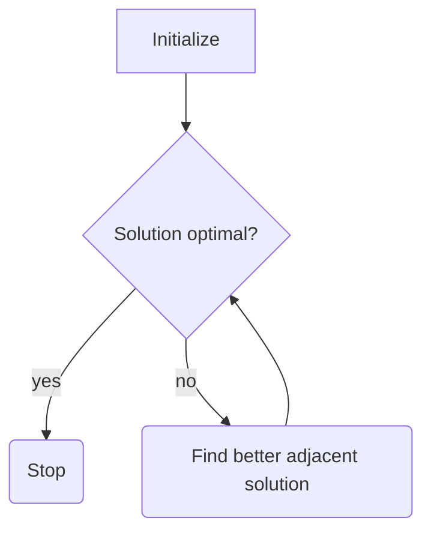

Operations Research
================
## Definition
> **Operations research** is a discipline that deals with the application of analytical mathematics for decision making.

## Steps
* Define the problem
* **Create mathematical model that fits the problem**
	* Real-world is too complex
	* Simplifies real-world concepts
* **Derive solutions**
	* Approach depends on the model
		* Linear programming
			* Functions of form $Z(x_1,x_2,x_3, \dots, x_n) = c_1*x_1 + c_2*x_2 + \dots + c_n*x_n$
			* Try to find the best set of $x_1, \dots, x_n$ so that the value of $Z$ is maximized or minimized
			* Goal: minimize/maximize $Z$
			* $Z$ is the *objective function*
			* $Z$ often has *constraints* which limit the values the variables can take
			* Standard form:
$$
\begin{aligned}
&\text{Select } x_1, x_2, \dots, x_n \text{ so that} \\
&Z = c_1*x_1 + c_2*x_2 + \dots + c_n*x_n \text{is maximal} \\
&\text{One or more constraints of form } \\
&a_1*x_1 + a_2*x_2 + \dots +a_n*x_n \leq b_1 \\
&\text{May be applied}
\end{aligned}
$$
			> **Feasible solutions** are solutions that do not violate any of the constraints. **Infeasible** solutions are those where one or more constraints are violated.
 
			 * &nbsp;
 
			> **Optimal solutions** are solutions where that are *feasible* and have the highest possible value for the objective function $Z$
			
			* Possibilities for optimal solutions
				* No feasible solutions (contradicting constraints)
				* No optimal solution (unbounded along at least one axis)
				* One optimal solution (one of the Corner-Point Feasible solutions)
				* Infinitely many optimal solutions (includes at least two CPF solutions)
		* Integer programming
		* Graph theory
		* Dynamic programming
		* Game theory
		* Queue theory
		* Simulation theory
* Test model
* Apply model
* Implementation

## The Simplex method

* Algebraic procedure based on geometry
* Geometry
	* Find CPF solutions
	* Optimality test: if no adjacent solutions are better ($Z'$ negative in both cases), then it must be an optimal solution
	* If not, then move to the best one ($Z'$ highest)
	* Repeat
* Iterative algorithm
* Algebraic solution
	* Create slack variables to normalize equations
	* Nonnegativity constraints are left alone
	* e.g. $x_1 \leq 4 \Rightarrow x_1+x_3 = 4 \land x_3 \geq 0$
	* In the end all equations are of form $$ \begin{aligned}
& \sum_1^n(a_k*x_k) = b_k \\
\text{and } & x_j \geq 0, 1\leq j\leq n
\end{aligned}$$
	* **Augmented solution** -- solution for the original variables with corresponding slack variables
	* **Basic solution** is an augmented CP solution
	* **Basic Feasible** (BF) solutions is an augmented CPF
	* Properties of basic solutions
		* The number of basic variables is equal to the number of functional constraints
		* Number of nonbasic variables is equal to the number of variables minus the number of constraints

